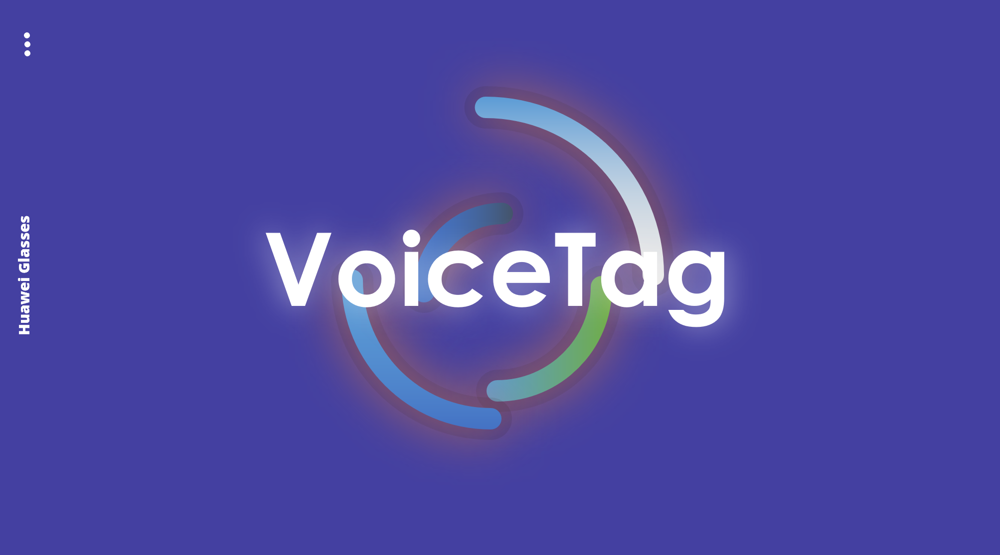
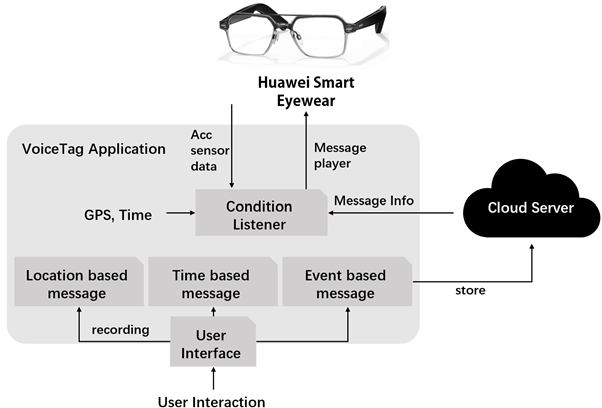

# VoiceTag - Report

Group 1 Paradox

## 1 Logo

Figure 1 VoiceTag Logo

## 2 Background

People may want to leave a message to somebody, expecting them to hear it at specific location, time or during specific activities.

However, the existing communication platforms, such as QQ and telegram, are too complicated to send such messages, and also can’t afford automatic message receiving.

With SmartEyeWear, we designed an app, “VoiceTag”, to enable users to receive voice messages at specific location, time, or during certain activities, which are created and shared by fellow users.

The messages are stored with specific information tagged in the app’s cloud, waiting to be triggered.

In this way, we have implemented our unique asynchronous communication pattern: through sensors of SmartEyeWear and GPS, pre-uploaded voice messages will be triggered automatically under certain conditions, pleasantly surprising users during their daily monotony.

After several tests, our app now supports message triggering during time interval of 5 mins, space interval of 30m radius and during a walk.

Figure 2 The Software Architecture

## 3 Interaction design

Three main application scenes:

### (1) Location 

Messages can be triggered when the user is in a specific location.

### (2) Time

Messages can be triggered when the user is at the same time.

### (3) Activity

Messages can be triggered when the user is doing a specific activity.

Belows are some concrete applications we proposed. However, this offers a brand new sandbox ecology, and we are glad to see more developers coming up with more interesting applications !

#### (1) Tour Guide

Providing users with guided tours of attractions.

#### (2) Treasure Game

## 4 Resource

- [Video link](https://www.bilibili.com/video/BV19t4y187GD/?vd_source=b1592a2cdc5bf2252eec2c8e8abce3d4).

- [Source code](https://github.com/hiskiv/VoiceTag).

- [Slide link in Baidu Cloud](https://pan.baidu.com/s/1M3S7V0K2F8VgKcBYpPcvHQ).

  password: v22h

## 5 Section & Contribution

- Liu Xiaokang:
  - 3200105838
  - Implement the front end of UI
  - Voice record function
  - Recording files storage management
  - Implement the location listener
- Jianjun Zhou：
  - 3200104293
  - MediaPlayer function
  - TextToSpeech function(and listener with MediaPlayer)
  - Audio playing according to activity
  - file read and write management
- Ganhao Chen：
  - 3200102534
  - MediaPlayer management
  - Audio playing according to location
  - Audio playing according to time
  - Filename management & parsing
